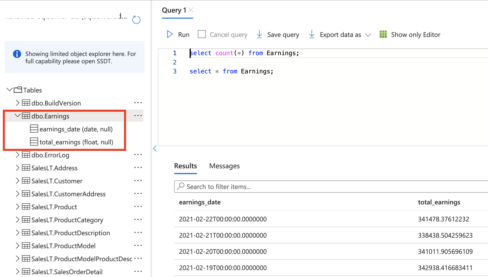

# Process data using Synapse Spark Pools and store them in Azure SQL Database

## outline

- Infra setup using Terraform. 
- Use the program to generate CSV data
- Upload CSV file to synapse ADLS (use Az Copy)
- Data clean/processing using Synapse Spark pools
- Load data into RDBMS

## Pre-reqs

- Install Azure CLI
- Install Terraform

## Infra setup

It creates key components such as resource group, storage account, ADLS file system, Synapse workspace, Synapse spark pool, Azure SQL database, Azure Key vault along with the secret required to connect with sql database

Clone the repo:

```bash
git clone https://github.com/abhirockzz/synapse-spark-sqldb
cd terraform_infra
```

In `main_tf` file, replace the component names for Synapse workspace etc.

Start off:

```bash
terraform init
terraform plan -out aimle2einfra.tfplan
```

Trigger infra creation:

```bash
terraform apply aimle2einfra.tfplan
```

Once the process is complete, check your resource group to confirm all the resources have been created properly.

## Prepare and upload data

Run the python program to prepare CSV data - `generate.ipynb`.

Once you're done, follow the steps below to upload it to the ADLS filesystem linked to your Synapse Workspace.

> It is assumed that you have saved the generate CSV file in a local folder named `data`

First, download [azcopy](https://docs.microsoft.com/en-us/azure/storage/common/storage-use-azcopy-v10?toc=/azure/storage/blobs/toc.json)

To upload your [directory to storage](https://docs.microsoft.com/en-us/azure/storage/common/storage-use-azcopy-blobs-upload#upload-a-directory):

Initiate login:

```bash
azcopy login
```

If you finish the auth successfully, you should see this:

```bash
INFO: Login succeeded.
```

Initiate copy:

```bash
azcopy copy 'data' 'https://<enter storage account name>.dfs.core.windows.net/<enter container name>' --recursive
```

The output similar to this:

```bash
INFO: Scanning...
INFO: Authenticating to destination using Azure AD
INFO: Any empty folders will be processed, because source and destination both support folders

Job fd3e3b59-a9ed-fe4b-5d07-8970fdf8d1d4 has started
Log file is located at: /Users/abhishekgupta/.azcopy/fd3e3b59-a9ed-fe4b-5d07-8970fdf8d1d4.log

0.0 %, 1 Done, 0 Failed, 1 Pending, 0 Skipped, 2 Total, 2-sec Throughput (Mb/s): 1.9659


Job fd3e3b59-a9ed-fe4b-5d07-8970fdf8d1d4 summary
Elapsed Time (Minutes): 0.1001
Number of File Transfers: 1
Number of Folder Property Transfers: 1
Total Number of Transfers: 2
Number of Transfers Completed: 2
Number of Transfers Failed: 0
Number of Transfers Skipped: 0
TotalBytesTransferred: 608974
Final Job Status: Completed
```

Check ADLS filesystem in Synapse Workspace - you should see a folder named `data` with the CSV file in it.


## Create a Linked Service for Azure Key Vault

The Azure Key Vault instance created using Terraform has the credentials (Secret) to connect with Azure SQL Database. To use this, you will first need to create a Linked Service for Azure Key Vault.

In the Manage section of the workspace, click New and locate the Azure Key Vault service type:


Enter the info for Linked Service. Make sure to use the right subscription and the appropriate Key Vault service (created via Terraform):


Don't forget to Publish


## Data cleanup and processing

Open Synapse workspace. Navigate to the Develop section (let menu) and import `data-processing.ipynb` notebook.

Open the notebook and attach the appropriate Spark pool before you proceed with the next steps.


Execute the cells, one by one

Define the schema:

```dotnetcli
from pyspark.sql.types import StructType,StructField, StringType, IntegerType, DateType, DoubleType

schema = StructType([ \
    StructField("num",IntegerType(),False), \
    StructField("date",DateType(),False), \
    StructField("resource_id",IntegerType(),False), \
    StructField("earnings", DoubleType(), False)
  ])
```

Read data from the cSV file you  had uploaded earlier. Make sure to use enter the correct file name

```python
data = (spark
                .read
                .csv("/data/<enter file name>.csv", header=True, schema=schema)
              )

data.printSchema()
data.show(5)
```

Write the data frame to Azure SQL Database. The table (named `Earnings`) will get created automatically.

```python
dbtable = "Earnings"

#uses synapse MSI based auth
url = TokenLibrary.getSecret("<enter key vault name>", "<enter key vault secret name>", "<enter linked service name>")

try:
  earnings.write \
    .format("com.microsoft.sqlserver.jdbc.spark") \
    .mode("append") \
    .option("url", url) \
    .option("dbtable", dbtable) \
    .save()
except ValueError as error :
    print("Connector write failed", error)
```

Read it back from the database:

```python
dbtable = "Earnings"

#uses synapse MSI based auth
url = TokenLibrary.getSecret("<enter key vault name>", "<enter key vault secret name>", "<enter linked service name>")

data = spark.read \
    .format("com.microsoft.sqlserver.jdbc.spark") \
    .option("url", url) \
    .option("dbtable", dbtable) \
    .load()

print(data.count())
data.show()
```

Things to note:

- you can also cross check the same directly in the Azure SQL Database



- you can use the same to read from other tables in SQL databse including the ones in the Adventure Works schema e.g. `SalesLT.Customer`
- Also applicable to other databases e.g. PostgreSQL

## Don't forget to DELETE everything!

```bash
terraform plan -destroy -out aimle2einfra.destroy.tfplan
terraform apply aimle2einfra.destroy.tfplan
```

## TODOs

If time permits, try:

- Access Synapse Spark pools from VSCode
- Use Pulumi to spin up infra